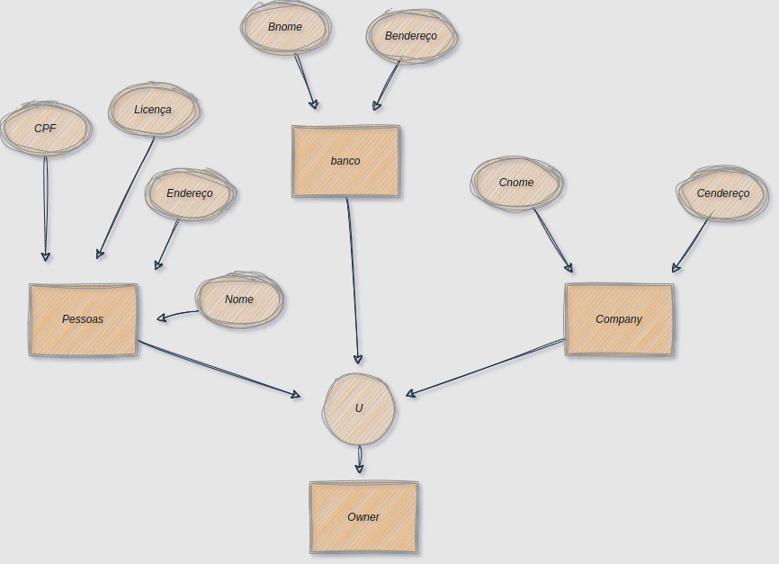

<h1>E-Commerce Database Schema</h1>

Este repositório contém o esquema de banco de dados para um sistema de e-commerce. Ele inclui tabelas para gerenciar fornecedores, produtos, estoque, clientes, pedidos, pagamentos e entregas.

<h2>Estrutura do Banco de Dados</h2>

O banco de dados foi projetado para suportar um sistema de e-commerce com os seguintes requisitos:

<ul>
<li><strong>Fornecedor:</strong> Informações sobre os fornecedores de produtos.</li>
<li><strong>Produto:</strong> Detalhes dos produtos que são vendidos na loja.</li>
<li><strong>Estoque:</strong> Controla o estoque dos produtos.</li>
<li><strong>Cliente:</strong> Armazena informações de clientes, incluindo pessoas físicas (PF) e jurídicas (PJ).</li>
<li><strong>Pagamento:</strong> Registra informações sobre pagamentos dos clientes.</li>
<li><strong>Pedido:</strong> Registra os pedidos feitos pelos clientes.</li>
<li><strong>Item_Pedido:</strong> Detalha os itens de cada pedido.</li>
<li><strong>Entrega:</strong> Registra o status da entrega de cada pedido.</li>
</ul>

<h2>Tabelas</h2>
<ul>
<li><strong>Fornecedor:</strong> Armazena dados sobre o fornecedor de produtos.</li>
<li><strong>Produto:</strong> Contém detalhes sobre os produtos fornecidos.</li>
<li><strong>Estoque:</strong> Controla a quantidade de cada produto disponível no estoque.</li>
<li><strong>Cliente:</strong> Armazena dados dos clientes, diferenciando entre Pessoa Física (PF) e Pessoa Jurídica (PJ).</li>
<li><strong>Pagamento:</strong> Registra as formas de pagamento dos clientes, com status e detalhes do pagamento.</li>
<li><strong>Pedido:</strong> Armazena informações sobre os pedidos feitos pelos clientes.</li>
<li><strong>Item_Pedido:</strong> Detalha os itens de um pedido específico.</li>
<li><strong>Entrega:</strong> Controla o status de entrega de um pedido, incluindo código de rastreio e datas relevantes.</li>
</ul>

<h2>Como foi feito</h2>

As tabelas foram criadas em SQL usando restrições e verificações de integridade para garantir a consistência e as regras de negócio. As principais considerações incluem:

<ul>
<li><strong>Cliente PF e PJ:</strong> O campo <code>tipo_cliente</code> na tabela <code>cliente</code> é um <code>ENUM</code> que define se o cliente é Pessoa Física (PF) ou Pessoa Jurídica (PJ). Com base nesse campo, ou o <code>cpf</code> ou o <code>cnpj</code> são obrigatórios, mas nunca ambos.</li>
<li><strong>Pagamentos:</strong> A tabela de <code>pagamento</code> pode armazenar múltiplas formas de pagamento para cada cliente, com um campo para detalhar os métodos utilizados.</li>
<li><strong>Entrega:</strong> A tabela <code>entrega</code> registra o status da entrega, permitindo acompanhar o rastreamento e o status de cada pedido.</li>
</ul>

<h2>Como usar</h2>

<h3>Configuração do Banco de Dados:</h3>
<ul>
<li>Clone este repositório para o seu ambiente local.</li>
<li>Importe o arquivo SQL para o seu banco de dados preferido, por exemplo, PostgreSQL, MySQL ou outro sistema de gerenciamento de banco de dados (SGBD).</li>
<li>Execute o script de criação de tabelas para gerar as tabelas no banco de dados.</li>
</ul>

<h3>Populando as Tabelas:</h3>

Após criar as tabelas, insira dados de exemplo nas tabelas de <code>fornecedor</code>, <code>produto</code>, <code>cliente</code>, entre outras, para testar o sistema.

<h3>Usando o Banco de Dados:</h3>

Agora você pode conectar o banco de dados ao backend da sua aplicação, usando o ORM (como Hibernate) ou consultas SQL diretas.

<h2>Como Colocar no GitHub</h2>

<h3>Passo 1: Crie um Repositório no GitHub</h3>
<ul>
<li>Acesse <a href="https://github.com/">GitHub</a>.</li>
<li>Clique no botão <strong>New</strong> para criar um novo repositório.</li>
<li>Dê um nome ao repositório (por exemplo, <code>ecommerce-database</code>).</li>
<li>Clique em <strong>Create repository</strong>.</li>
</ul>

<h3>Passo 2: Suba o arquivo SQL para o GitHub</h3>
<pre>
# Inicialize um repositório Git
git init

# Adicione o arquivo SQL ao repositório
git add nome_do_arquivo.sql

# Commit das alterações
git commit -m "Adiciona o esquema de banco de dados para e-commerce"

# Adiciona o repositório remoto (substitua o URL do repositório pelo seu)
git remote add origin https://github.com/SEU_USUARIO/ecommerce-database.git

# Envia o arquivo para o GitHub
git push -u origin master
</pre>

<h3>Passo 3: Acesse o Repositório no GitHub</h3>
<ul>
<li>Vá para o repositório no GitHub e verifique se o arquivo foi carregado corretamente.</li>
<li>Agora, o código SQL estará disponível publicamente ou apenas para você, dependendo das configurações de visibilidade do repositório.</li>
</ul>

<h2>Contribuição</h2>

Contribuições são bem-vindas! Se você quiser melhorar ou ajustar o esquema do banco de dados, sinta-se à vontade para fazer um fork do repositório e enviar um pull request.

<h2>Licença</h2>

Este projeto está licenciado sob a MIT License.

